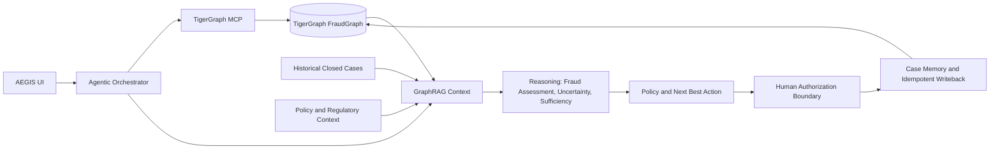

# AEGIS

**Agentic Evidence & Graph Intelligence System** is an agentic fraud-investigation system powered by TigerGraph. It turns a fraud signal, customer report, or analyst request into an evidence-grounded investigation: the agent queries graph relationships through MCP, synthesizes graph and historical context, assesses uncertainty and evidence sufficiency, applies policy, recommends a next best action, and persists the resulting case record for future investigation.

Built for the **TigerGraph HHGOA Challenge, Task 4**.

## Demo

[Watch the AEGIS demo on YouTube](https://youtu.be/0oeTPoTNVy4)

## Technical Blog

[Building AEGIS: An Agentic Fraud Investigation System with TigerGraph, MCP, and GraphRAG](https://dev.to/kanwalvyas/building-aegis-an-agentic-fraud-investigation-system-with-tigergraph-mcp-and-graphrag-521f)

## What AEGIS Does

AEGIS follows an auditable investigation lifecycle:

```text
Fraud signal / customer report
  -> alert triage
  -> agentic investigation
  -> TigerGraph + MCP evidence gathering
  -> GraphRAG historical and policy context
  -> fraud assessment
  -> uncertainty and evidence sufficiency
  -> additional-evidence planning
  -> policy evaluation
  -> next best action
  -> human authorization
  -> case memory and TigerGraph writeback
```

The central safety boundary is:

> **Recommendation != Authorization != Execution**

The agent can recommend a card block, verification, monitoring, or reporting step. It does not autonomously execute destructive actions from the demo flow.

## Key Features

- **TigerGraph investigation:** retrieves transaction facts and explores connected customers, cards, devices, regions, and historical cases.
- **MCP tool layer:** exposes typed TigerGraph investigation capabilities that return structured evidence, provenance, metrics, and limitations.
- **Evidence-driven planning:** chooses the next justified investigation tool from evidence already collected, within a bounded budget.
- **GraphRAG synthesis:** combines graph facts with historical closed-case precedent, policy context, and applicable regulatory references.
- **Fraud-pattern analysis:** examines velocity, card testing, regional anomalies, shared devices, and connected-card relationships.
- **Explicit uncertainty and sufficiency:** distinguishes a fraud assessment from confidence, uncertainty, evidence gaps, and whether evidence supports action.
- **Controlled additional-evidence planning:** identifies targeted customer, analyst, or connected-card evidence needed before irreversible action.
- **Policy and next best action:** evaluates constraints, approval routing, and a policy-grounded recommendation.
- **SAR preparation:** generates auditable SAR preparation packages for applicable cases for review; it does not autonomously file with regulators.
- **Case memory and idempotent writeback:** persists investigation findings and writes the case graph back to TigerGraph without duplicating a case vertex.
- **WCC graph algorithm:** `run_fraud_ring_wcc` detects a weakly connected entity component seeded from a card. It is a structural graph signal for further investigation, not a fraud verdict.

## Architecture



The orchestrator keeps the investigation loop separate from the policy and authorization boundary. TigerGraph is the relationship and evidence layer; GraphRAG provides grounded context; policy determines what may be recommended and the route needed before execution.

## TigerGraph Graph Model

`FraudGraph` models the entities used to investigate relationships across an alert:

| Vertex | Investigation role |
|---|---|
| `Customer` | Cardholder identity linked to cards. |
| `Card` | Payment card and card-level activity baseline. |
| `DeviceProfile` | Device attributes used to identify shared-device relationships. |
| `EmailDomain` | Purchaser email-domain context. |
| `BillingRegion` | Billing-region context for regional-anomaly analysis. |
| `Transaction` | Flagged or historical payment event with amount, time, channel, and score. |
| `ClosedCase` | Historical resolved investigation and analyst precedent. |
| `InvestigationCase` | Active or resolved AEGIS investigation persisted to the graph. |

Important schema relationships include:

- `OWNS_CARD`: `Customer -> Card`
- `PERFORMED_TXN`: `Card -> Transaction`
- `USED_DEVICE`: `Transaction -> DeviceProfile`
- `BILLED_IN`: `Transaction -> BillingRegion`
- `PURCHASER_EMAIL`: `Transaction -> EmailDomain`
- `PRECEDES`: `Transaction -> Transaction`
- `INVOLVES`: `ClosedCase` or `InvestigationCase -> Transaction`
- `ON_CARD`: `ClosedCase` or `InvestigationCase -> Card`
- `CONNECTED_TO`: `ClosedCase` or `InvestigationCase -> Card`

These relationships let AEGIS investigate a transaction in the context of connected entities instead of treating an alert as an isolated row.

## Agentic Investigation

The `AgenticFraudInvestigator` runs a bounded investigation loop with an **eight-step maximum**. It starts with the flagged transaction and then selects tools based on returned evidence and trigger modality. It does not blindly execute every available tool.

Representative MCP tools include:

- `get_transaction`
- `get_customer_history`
- `get_card_history`
- `detect_velocity`
- `find_shared_devices`
- `find_connected_cards`
- `get_historical_cases`
- `run_fraud_ring_wcc`

For example, a shared device result can justify an expansion to connected cards. A low-risk case with no graph anomaly can stop early. Every executed call is recorded as an investigation step with its arguments, outcome, and evidence summary.

## MCP

`TigerGraphMCPServer` exposes read-only investigation capabilities to the agent through the Model Context Protocol layer. Each handler validates its input and returns compact, agent-ready results with a status, backend provenance, structured subject data, evidence statements, metrics, and limitations.

This separation keeps TigerGraph queries available to the agent as explicit tools rather than hidden implementation detail. The tools can use a live TigerGraph backend when available and fall back to the repository's sample graph mode when it is not.

## GraphRAG

GraphRAG builds a context from the current trigger and evidence collected by the agent. It includes:

- live graph facts and detected patterns;
- historical closed cases, including confirmed-fraud and cleared precedent;
- applicable policy context and regulatory references where applicable;
- supporting and contradictory evidence;
- evidence gaps and source provenance.

Historical cases inform investigation context and policy reasoning. They do not automatically determine the fraud verdict for the current case. The retriever uses a deterministic BM25 index and metadata filters over the repository's case, policy, and regulatory corpora.

## Reasoning, Uncertainty & Evidence Sufficiency

AEGIS evaluates three separate questions:

| Question | Meaning |
|---|---|
| **Fraud assessment** | The current conclusion, such as `LIKELY_FRAUD`, `SUSPICIOUS_BUT_UNCERTAIN`, or `LIKELY_BENIGN`. |
| **Uncertainty** | The remaining epistemic uncertainty and its reasons, including conflicting evidence or missing customer confirmation. |
| **Evidence sufficiency** | Whether available evidence is sufficient, partial, conflicting, or insufficient for the proposed decision. |

A strong signal is not automatically sufficient evidence for a destructive action. When evidence is incomplete or conflicting, the reasoning engine plans focused additional evidence rather than treating a model score or graph pattern as proof.

## Policy & Next Best Action

The deterministic policy engine evaluates the proposed action against bank rules and determines:

- whether the action is permitted;
- required action or prerequisites;
- approval route and whether approval is required;
- violations and execution boundaries.

The next best action engine then issues a recommendation such as `BLOCK_CARD`, `VERIFY_WITH_CUSTOMER`, `CLOSE_NO_FRAUD`, or monitoring-oriented action. A direct customer dispute can produce the following state:

```text
BLOCK_CARD
  -> L1 APPROVAL REQUIRED
  -> PENDING_APPROVAL
```

The recommendation is visible to a human reviewer, while execution stays outside the demo flow and authorization boundary.

## SAR Preparation

For applicable cases, AEGIS evaluates SAR readiness and generates an auditable SAR preparation package for review. Packages include the relevant case data, exposure, investigation findings, rationale, and regulatory references.

AEGIS does **not** autonomously file SARs with regulators. Filing requires external human compliance review and approval.

## Case Memory & Writeback

Each investigation maintains a case lifecycle and persists evidence, findings, policy decisions, recommended actions, uncertainty, and SAR data in case memory.

When live TigerGraph connectivity is available, idempotent writeback upserts an `InvestigationCase` vertex and links it through:

- `INVOLVES` to the triggering `Transaction`;
- `ON_CARD` to the investigated `Card`.

The writeback engine avoids duplicating a case vertex when the same case is updated. A local sample-graph mirror supports the same workflow in offline mode.

## Live Demo: HHG-010

The Live Agent UI demonstrates the end-to-end investigation of `HHG-010`:

```text
Risk-score alert
  -> get_transaction
  -> detect_velocity
  -> find_shared_devices
  -> find_connected_cards
  -> get_historical_cases
  -> reasoning and uncertainty assessment
  -> policy evaluation
  -> VERIFY_WITH_CUSTOMER
  -> L1 APPROVAL REQUIRED
  -> PENDING_APPROVAL
  -> SAR preparation recommendation
  -> graph writeback
```

The committed benchmark record for HHG-010 has a `$1,000.03` exposure and a `0.90` risk score. Its graph investigation identifies shared-device and connected-card evidence, while the final assessment remains `SUSPICIOUS_BUT_UNCERTAIN`. The resulting `VERIFY_WITH_CUSTOMER` recommendation is held at the L1 authorization boundary, with SAR preparation recommended and case writeback recorded.

The current Live Agent UI does not accept a customer response for HHG-010, so this demo flow does not claim a customer-response reassessment.

## Benchmark & Results

Final benchmark artifacts cover 20 HHGOA cases across customer reports, risk-score alerts, and analyst requests.

| Verified result | Value |
|---|---:|
| Benchmark cases evaluated | `20 / 20` |
| Persisted investigation cases | `20 / 20` |
| Average tool calls per case | `4.25` |
| Budget compliance | `100%` |
| Duplicate tool calls | `0` |
| Missing-entity / NaN contamination | `0` |
| Policy reference mismatches | `0` |
| Unreferenced destructive recommendations | `0` |
| Denied destructive actions emitted | `0` |
| Lifecycle / outcome inconsistencies | `0` |
| SAR preparation packages generated | `10` |
| Automated tests passed | `111` |

See [`artifacts/benchmark/benchmark_summary.md`](artifacts/benchmark/benchmark_summary.md) and [`artifacts/benchmark/evaluation_results.json`](artifacts/benchmark/evaluation_results.json) for the final benchmark records.

## HHGOA Requirements Coverage

| Challenge area | AEGIS implementation |
|---|---|
| TigerGraph relationship layer | `FraudGraph` schema models customers, cards, transactions, device profiles, cases, and their investigative relationships. |
| GSQL | Investigation and validation queries are defined in `tigergraph/queries/`. |
| Graph algorithm | `run_fraud_ring_wcc` provides a WCC-based structural connectivity signal for multi-entity investigation. |
| TigerGraph MCP | Typed MCP schemas and handlers expose graph investigation tools with evidence and provenance. |
| GraphRAG | Synthesizes graph evidence, historical cases, policy, and regulatory context with source attribution. |
| Agentic investigation | Bounded, evidence-driven tool selection and investigation trace, with an eight-step limit. |
| Uncertainty and sufficiency | Separate deterministic evaluation of assessment, uncertainty, sufficiency, gaps, and contradictions. |
| Additional evidence | Plans controlled customer, analyst, and connected-card evidence requests; the orchestrator supports reassessment when such evidence is supplied. |
| Policy and permissions | Rules evaluate safeguards, approval routes, prerequisites, and permitted recommendations. |
| Next best action | Produces policy-grounded recommendations and maintains the execution boundary. |
| Case memory | Persists evidence, findings, decisions, lifecycle state, and SAR data. |
| UI | FastAPI dashboard provides benchmark exploration, case deep dive, live agent trace, and TigerGraph topology views. |
| 20-case benchmark | Final machine-readable results, case files, and summary cover all 20 benchmark cases. |
| SAR preparation | Generates review-ready preparation packages for applicable cases without autonomous filing. |

## Technology Stack

- **Python** for orchestration, reasoning, MCP integration, data handling, and tests
- **FastAPI** and **Uvicorn** for the web application and API
- **TigerGraph** and **GSQL** for graph storage, queries, algorithms, and live writeback
- **Model Context Protocol (MCP)** for the graph-tool interface
- **GraphRAG** with deterministic **BM25** retrieval and metadata filters
- **Pydantic** and **pydantic-settings** for typed models and configuration
- **pandas** and **NumPy** for dataset processing
- **HTML, CSS, and JavaScript** for the analyst UI

## Repository Structure

```text
src/
  agent/       # Orchestrator, planner, and provider interfaces
  tigergraph/  # Live/sample clients and investigation tools
  mcp/         # MCP schemas and server handlers
  rag/         # Corpus, retrieval, adapters, and context synthesis
  reasoning/   # Evidence, uncertainty, sufficiency, policy, NBA, explanations
  memory/      # Case store, lifecycle, SAR evaluation, and graph writeback
  ui/          # FastAPI analyst dashboard
scripts/       # Benchmark, deployment, validation, and artifact scripts
tigergraph/    # GSQL schema, loading jobs, and queries
artifacts/     # Final benchmark results, case files, and SAR preparation packages
tests/         # Automated test suite
```

## Running Locally

### Prerequisites

- Python 3.10 or later
- Optional: a reachable TigerGraph deployment for live graph connectivity

### Install and start the dashboard

```bash
git clone https://github.com/kanwal-vyas/agentic-fraud-investigation.git
cd agentic-fraud-investigation

python -m venv .venv
# Windows: .\.venv\Scripts\activate
# Linux/macOS: source .venv/bin/activate

pip install -r requirements.txt
python src/ui/app.py
```

Open `http://127.0.0.1:8000` to use the FastAPI dashboard.

To run the automated test suite:

```bash
pytest -q
```

## TigerGraph Configuration

The application reads configuration from environment variables or a local `.env` file. For live TigerGraph connectivity, configure the host, graph name, and appropriate authentication values using the variable names defined in [`.env.example`](.env.example):

- `TG_HOST`
- `TG_GRAPH`
- `TG_USERNAME`
- `TG_PASSWORD`
- `TG_SECRET` or `TG_API_TOKEN`

Optional model-provider and server settings are also documented in `.env.example`. Do not commit a populated `.env` file.

If a live TigerGraph service is unavailable, the investigation tools use the repository's offline/sample graph mode. This supports local exploration and deterministic benchmark workflows without live connectivity.

## Project Status

AEGIS is the completed HHGOA submission implementation. The repository includes final benchmark artifacts, final automated-test results, live TigerGraph integration with offline/sample support, the recorded demo, and the technical blog.

## Links

- [GitHub repository](https://github.com/kanwal-vyas/agentic-fraud-investigation)
- [YouTube demo](https://youtu.be/0oeTPoTNVy4)
- [DEV.to technical blog](https://dev.to/kanwalvyas/building-aegis-an-agentic-fraud-investigation-system-with-tigergraph-mcp-and-graphrag-521f)

## Important Notes / Design Principles

- Evidence before action.
- Uncertainty is explicit.
- Recommendation != Authorization != Execution.
- Historical precedent informs rather than dictates.
- Destructive actions require authorization.
- SAR output is preparation, not autonomous filing.
- Graph relationships provide investigative context.
- Case memory preserves investigation history.
