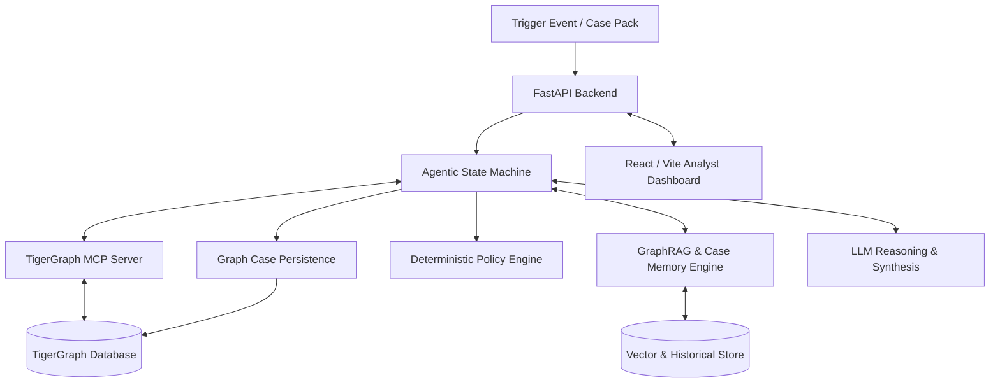

# System Architecture: TigerGraph Agentic Fraud Investigation System

## 1. System Components
1. **TigerGraph Database (Savanna / Community Edition)**
   - High-performance native graph database storing Customers, Cards, Transactions, DeviceProfiles, EmailDomains, BillingRegions, and ClosedCases.
   - Executes GSQL queries, subgraph expansions, graph algorithms (PageRank, Louvain/Community Detection, Shortest Path / Multi-hop Ring Detection), and Vector/Graph index retrieval.
2. **TigerGraph MCP Server (`tigergraph-mcp`)**
   - Implements the Model Context Protocol (MCP) exposing standard tools (`get_customer`, `get_card_history`, `get_transaction_neighborhood`, `find_shared_device_rings`, `find_similar_cases`, `write_case_to_graph`) directly to the LLM agent.
3. **GraphRAG & Knowledge Retriever Layer**
   - Combines graph neighborhood subgraphs, historical case embeddings/BM25 retrieval from `closed_cases_history.csv`, and fraud policy/typology chunks into structured grounded context.
4. **Agent Core (Deterministic State Machine + LLM Reasoning Loop)**
   - Explicit state machine managing investigation lifecycle:
     `TRIGGERED` → `CASE_OPENED` → `GRAPH_INVESTIGATION` → `EVIDENCE_ASSESSMENT` → `UNCERTAINTY_CHECK` → `EVIDENCE_REQUEST` (Simulated loop) → `RE_ASSESSMENT` → `NEXT_BEST_ACTION` → `POLICY_CHECK` → `CASE_MEMORY_PERSISTENCE` → `SAR_GENERATION` → `CASE_CLOSED`.
   - Incorporates structured uncertainty metrics (evidence count, signal conflicts, calibration probability, readiness).
5. **Deterministic Policy & Approval Engine**
   - Independent verification engine that enforces Rules R1–R10, maps actions to strict approval routes (`auto`, `L1`, `L2`), and validates regulatory SAR criteria.
6. **FastAPI Application Server**
   - REST & WebSocket backend serving API endpoints for case dispatch, interactive investigation execution, live tool execution streaming, and benchmark evaluation.
7. **React/Vite Investigation Dashboard UI**
   - Single-page command dashboard displaying graph visualizer, case progression timeline, evidence ledger with entity refs, uncertainty gauges, tool invocation logs, and human-in-the-loop approval actions.

---

## 2. Component Communication & Data Flow

- **Agent ↔ TigerGraph:** Through TigerGraph MCP standard tool protocol (JSON-RPC over stdio/HTTP or direct pyTigerGraph MCP wrapper).
- **Agent ↔ LLM:** Structured JSON prompt templates with strict schema adherence.
- **Frontend ↔ Backend:** REST API for case execution + SSE/WebSocket for streaming live tool calls, state transitions, and graph visual updates.

---

## 3. What Runs Locally vs. In TigerGraph

### Running Locally:
- **FastAPI backend** (orchestrator, API, policy engine, evaluation runner).
- **Agentic state machine & reasoning controller**.
- **GraphRAG retriever & BM25 / embedding memory indices**.
- **React/Vite Analyst Dashboard UI**.
- **Evaluation runner** processing the 20 benchmark cases and generating `<case_id>.json` deliverables.

### Running in TigerGraph:
- **Native Graph Schema & Storage** (`Customer`, `Card`, `Transaction`, `DeviceProfile`, `EmailDomain`, `BillingRegion`, `ClosedCase`, `Case`).
- **GSQL Pre-compiled Queries & Algorithms**:
  - `card_transaction_window` (velocity, testing detection)
  - `shared_device_rings` (cross-card syndicate discovery)
  - `out_of_region_traversal` (geographic anomaly vs baseline)
  - `transaction_subgraph` (ego-network extraction for GraphRAG)
  - `similar_case_neighbors` (graph-based case memory matching)

---

## 4. What Runs Through TigerGraph MCP
The agent accesses TigerGraph exclusively through defined MCP tools:
1. `mcp_get_transaction_details`: Fetches full transaction features, risk score, timestamps, and attributes.
2. `mcp_get_card_history`: Retrieves card timeline, baseline averages, and transaction sequences.
3. `mcp_get_device_connections`: Identifies other cards and customers sharing the exact `DeviceProfile`.
4. `mcp_get_region_connections`: Identifies sudden shifts in `addr1` / `addr2`.
5. `mcp_find_similar_historical_cases`: Graph traversal matching cases with shared entities, devices, or transaction patterns.
6. `mcp_persist_case_to_graph`: Writes the newly created/updated case node and edges (`INVOLVES`, `ON_CARD`, `CONNECTED_TO`) into TigerGraph.

---

## 5. What is the Agent?
The agent is a **hybrid deterministic state machine and LLM reasoning engine**:
- State transitions are strictly controlled (preventing hallucinated states or infinite looping).
- LLM is used where semantic reasoning is paramount: tool selection, synthesizing graph evidence, estimating calibrated fraud probability, drafting regulatory SAR narratives, and explaining decisions.
- LLM is constrained: every factual claim must cite an entity ID and tool reference (`ref`), adhering to the strict schema required by the hackathon benchmark.

---

## 6. How GraphRAG Works
1. **Graph Evidence Extraction:** TigerGraph MCP retrieves the 1-hop and 2-hop ego-network around the flagged transaction, card, customer, and device profile.
2. **Policy & Typology Retrieval:** Relevant policy rules (R1–R10) and regulatory typology definitions (FinCEN/FATF guidance) are retrieved based on the preliminary signals.
3. **Historical Case Retrieval:** The most similar past investigations (`closed_cases_history.csv`) with matching device profiles, merchants, or pattern signatures are retrieved.
4. **Context Synthesis:** Graph nodes, edges, tabular anomalies, policy constraints, and past case resolutions are assembled into a structured prompt context for the agent to deduce patterns and evaluate uncertainty.

---

## 7. Case Memory Storage
- **Primary Persistent Store:** TigerGraph itself! When a case is closed or updated, a `Case` vertex is inserted with edges linking to the subject `Transaction`, `Card`, `Customer`, and `DeviceProfile`.
- **In-Memory / Vector Cache:** Embeddings of case summaries and analyst notes from `closed_cases_history.csv` + new cases are indexed for semantic recall alongside exact graph traversals.

---

## 8. Deterministic Policy Enforcement
Policy is decoupled from raw LLM output:
1. The agent proposes a candidate action and estimated probability.
2. The **Policy Engine** evaluates the facts against Rules R1–R10:
   - Verifies if probability < 0.70 with single signal requires `VERIFY_WITH_CUSTOMER` (R1).
   - Validates if `FILE_REPORT` criteria are met (exposure > $1,000, shared origin R6, or undocumented R9).
   - Automatically assigns the strict approval route (`auto`, `L1`, `L2`).
3. If an action requires approval, the system flags it as pending human approval, allowing simulated or analyst authorization.

---

## 9. UI & Agent Communication
- The React UI connects to FastAPI via REST and Server-Sent Events (SSE).
- The analyst can:
  - Select any of the 20 benchmark cases or ingest real-time transactions.
  - Watch the live agent thought process, tool execution trace, and graph updates.
  - Interact with pending approvals (`L1`/`L2` sign-off) or trigger simulated customer responses.
  - View the SAR filing narrative and export full answer JSONs.

---

## 10. Benchmark 20-Case Evaluation Pipeline
- Evaluator script (`evaluation/evaluate_cases.py`) iterates through all 20 rows of `case_pack.csv`.
- For each case, it executes the full investigation loop, records initial recommendations, simulates necessary evidence collection, records updated final recommendations, drafts SARs where applicable, persists the case to TigerGraph, and outputs `<case_id>.json` in `cases/`.
- Generates a comprehensive validation report (`docs/EVALUATION_REPORT.md`) verifying schema conformance, calibration, tool calls, and policy adherence across all 20 benchmark cases.
