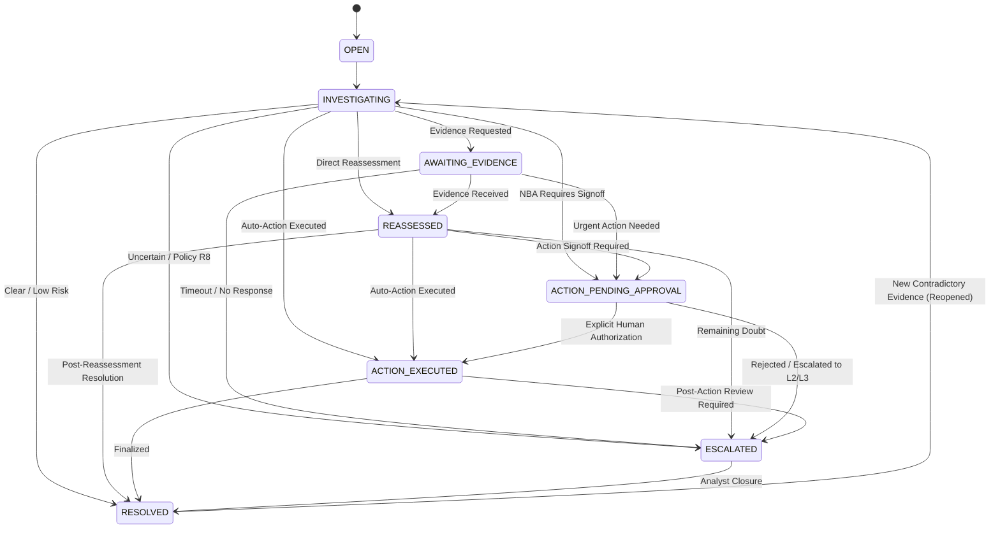

# Stage 8: Case Memory, Persistence & Graph Writeback Engine

## 1. Overview & Architectural Role

Stage 8 completes the end-to-end investigation lifecycle of the Autonomous Fraud Investigation Agent:

```
TRIGGER
   │
   ▼
CREATE CASE MEMORY (Status: OPEN)
   │
   ▼
INVESTIGATE (Status: INVESTIGATING)
   ├── Call TigerGraph MCP Tools
   └── Append Evidence Items (category: graph_fact, explicit provenance)
   │
   ▼
ASSESS UNCERTAINTY & REASONING CHECKPOINTS
   │
   ├── [Evidence Gap Detected] ──► REQUEST EVIDENCE (Status: AWAITING_EVIDENCE)
   │                                     │
   │                                     ▼ (Simulated Customer / Analyst Signal)
   │                               REASSESS (Status: REASSESSED)
   │
   ▼
EVALUATE BANK POLICIES (Rules R1 - R10)
   │
   ▼
RECOMMEND NEXT BEST ACTION (NBA)
   │
   ├── [Approval Required] ──► PENDING_APPROVAL (Status: ACTION_PENDING_APPROVAL)
   │                                  │ (Strict Authorization Boundary)
   │                                  ▼ (Explicit Human Signoff)
   │                             AUTHORIZED & EXECUTED (Status: ACTION_EXECUTED)
   │
   └── [Auto-Approved] ──────► RESOLVED (Status: RESOLVED / ESCALATED)
   │
   ▼
EVALUATE REGULATORY COMPLIANCE (FinCEN SAR 31 CFR 1020.320)
   │
   ▼
IDEMPOTENT GRAPH WRITEBACK (TigerGraph Live or Offline Sample Adapter)
   ├── Upsert Case Vertex
   ├── Link INVOLVES ──► Transaction
   ├── Link ON_CARD ──► Card
   └── Link CONNECTED_TO ──► Connected Cards
   │
   ▼
PERSIST FINAL CASE MEMORY (Indexed by Customer, Card, Pattern, Status)
   │
   ▼
DYNAMIC RETRIEVAL AVAILABLE TO FUTURE INVESTIGATIONS
```

---

## 2. Case Memory Data Model

The case memory model (`src/models/case_memory.py`) stores a strongly-typed, comprehensive audit of the investigation:

| Field | Type | Description |
| :--- | :--- | :--- |
| `case_id` | `str` | Unique case identifier (e.g., `HHG-003`, `CASE-20260923-01`) |
| `benchmark_case_id` | `Optional[str]` | Grounded benchmark case ID if applicable |
| `customer_id` | `str` | Target cardholder customer identifier |
| `card_id` | `str` | Primary card under investigation |
| `triggering_txn_id` | `int` | Seed transaction identifier |
| `trigger_type` | `str` | `risk_score`, `customer_report`, `analyst_request` |
| `created_at` / `updated_at` | `str` | ISO 8601 timestamps |
| `status` | `CaseLifecycleStatus` | Formal lifecycle state (see Section 3) |
| `fraud_assessment` | `str` | `likely_fraud`, `suspicious_but_uncertain`, `likely_benign` |
| `confidence` | `float` | Investigation assessment confidence (0.0 - 1.0) |
| `uncertainty_level` | `str` | `low`, `moderate`, `material`, `high` |
| `evidence_items` | `List[PersistedEvidenceItem]` | Atomic facts with explicit source provenance |
| `evidence_gaps` | `List[str]` | Unresolved information gaps |
| `fraud_patterns_identified` | `List[str]` | Official patterns (e.g. `card_testing`, `velocity_attack`) |
| `supporting_findings` | `List[str]` | Evidence supporting fraud hypothesis |
| `contradictory_findings` | `List[str]` | Benign indicators / customer travel clearances |
| `policy_rules_evaluated` | `List[str]` | Rules evaluated (e.g. `R1`, `R2`, `R7`, `R8`) |
| `policy_decision` | `CaseDecisionRecord` | Permission status, violations, prerequisites |
| `recommended_nba` | `str` | Recommended Next Best Action |
| `nba_rationale` | `str` | Grounded justification referencing rules & evidence |
| `approval_required` | `bool` | Whether human supervisory approval is required |
| `approval_route` | `str` | Required approval tier (`auto`, `L1`, `L2`, `L3`) |
| `execution_status` | `ActionExecutionStatus` | `RECOMMENDED`, `PENDING_APPROVAL`, `AUTHORIZED`, `EXECUTED` |
| `actions_actually_executed` | `List[ActionAuditRecord]` | Audit trail of authorized and executed side-effects |
| `evidence_requests` | `List[Dict[str, Any]]` | Structured external information requests |
| `reassessments` | `List[ReassessmentRecord]` | Reassessment history with incoming evidence |
| `final_outcome` | `str` | `closed_fraud`, `closed_legitimate`, `escalated` |
| `sar_data` | `SARCaseRecord` | FinCEN 31 CFR 1020.320 SAR readiness evaluation |
| `related_historical_case_ids` | `List[str]` | Precedent case IDs retrieved via GraphRAG |
| `related_entities` | `Dict[str, List[str]]` | Connected graph entities (cards, devices, customers) |
| `written_to_graph` | `bool` | Boolean flag confirming graph writeback |

---

## 3. Case Lifecycle State Machine

The case lifecycle is managed deterministically by `CaseLifecycleManager` (`src/memory/lifecycle.py`):



### Strict Distinction: Recommendation vs Authorization vs Execution
- **RECOMMENDED:** NBA Engine produces an action recommendation based on policy rules.
- **PENDING_APPROVAL:** If `approval_required == True` (destructive actions like `BLOCK_CARD`, `BLOCK_ALL_CARDS`, `DECLINE_TRANSACTION`, `FILE_REPORT`), the action is held at the human-in-the-loop boundary.
- **AUTHORIZED & EXECUTED:** Destructive actions can **never** become `EXECUTED` automatically. They require calling `CaseLifecycleManager.authorize_and_execute_action(case, action, authorized_by="<analyst_id>")`.

---

## 4. Case Memory Persistence Architecture

The persistence layer (`src/memory/case_store.py`) provides a clean interface (`CaseStoreInterface`) and a deterministic, thread-safe in-memory/offline implementation (`InMemoryCaseStore`):

- Multi-dimensional indexing across:
  - `customer_id`
  - `card_id`
  - `fraud_pattern`
  - `case_id`
- Similarity search (`search_similar_cases(query, top_k)`):
  - Returns structured `HistoricalCaseMatch` objects.
  - Automatically incorporates persisted closed cases into future investigation retrieval without polluting current evidence.

---

## 5. TigerGraph Idempotent Graph Writeback

The writeback engine (`src/memory/graph_writeback.py`) connects active and resolved cases directly into the TigerGraph graph topology:

### Graph Schema Alignment
- **Vertex `Case`:** `case_id`, `status`, `verdict`, `fraud_probability`, `pattern`, `pattern_description`, `exposure_usd`, `summary`, `created_at`.
- **Edge `INVOLVES`:** `Case` $\rightarrow$ `Transaction` (links case to seed transaction).
- **Edge `ON_CARD`:** `Case` $\rightarrow$ `Card` (links case to primary card).
- **Edge `CONNECTED_TO`:** `Case` $\rightarrow$ `Card` (links case to connected cards in multi-card syndicate investigations).

### Dual Mode & Idempotency
- **LIVE Mode:** Executes GSQL vertex and edge upserts via `TigerGraphClient.upsert_vertex()` and `upsert_edge()`.
- **OFFLINE Mode:** Updates the topological index in `SampleGraphClient.upsert_case()` and `upsert_edge()`.
- **Idempotent Updates:** Repeated updates to an existing case update vertex attributes in place without duplicating Case vertices.

---

## 6. Regulatory SAR Readiness (FinCEN 31 CFR 1020.320)

`SARCaseEvaluator` (`src/memory/sar_generator.py`) evaluates statutory Suspicious Activity Report filing requirements:

- **Mandatory Threshold:** Unauthorized transactions $\ge \$500$ with confirmed fraud assessment.
- **Coordinated Syndicate Pattern:** Account takeover or multi-card fraud syndicate indicators.
- **Supervisory Escalation:** Rule R8 multi-card exposure escalations.
- **Auditable Memorandum:** Generates a structured narrative without initiating fake external submissions.

---

## 7. 20-Case Benchmark Persistence Verification

The full 20-case benchmark suite (`scripts/run_agent_benchmark.py`) validates case creation, investigation, reasoning, policy enforcement, writeback, and persistence:

| Benchmark Metric | Target | Result | Status |
| :--- | :--- | :--- | :--- |
| **Total Cases Evaluated** | 20 | 20 | PASS |
| **Persisted Case Records** | 20 | 20 | PASS |
| **Average Tool Calls / Case** | $\le 8.0$ | 4.25 | PASS |
| **Duplicate Tool Call Rate** | 0.0% | 0.0% | PASS |
| **Cases Stopping Within Limit** | 100.0% | 100.0% | PASS |
| **Missing-Entity Contamination** | 0 | 0 | PASS |
| **Policy Reference Mismatches** | 0 | 0 | PASS |
| **Unreferenced Destructive Actions** | 0 | 0 | PASS |
| **Denied Destructive Actions Emitted**| 0 | 0 | PASS |
